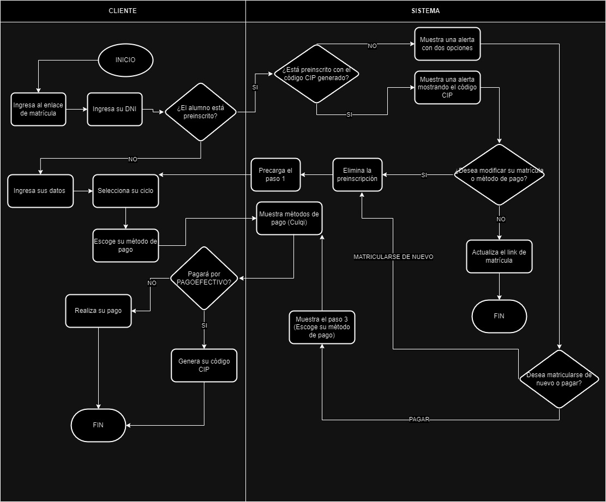

<h3 align="center">APP MATRICULA</h3>

Es una aplicación dedicada al registro de inscripciones de estudiantes para la Academia Vonex, Sistema Integrado con la pasarela de pagos Culqi, Emisión de correos con las API de Google y API Peru Dni que obtiene los datos del usuario.

## ÍNDICE
<ul>
    <li><a href="#requerimientos">Requerimientos del servidor</a></li>
    <li><a href="#tecnologia">Tecnologías</a></li>
    <li><a href="#librerias">Librerias</a></li>
    <li><a href="#seguridad">Seguridad</a></li>
    <li><a href="#modulos">Módulos</a></li>
    <li><a href="#pasarela">Integración de servicios</a></li>
    <li><a href="#diagrama">Diagrama de flujo</a></li>
  </ul>

## Requerimientos del servidor
<ul>
    <li>Php 8.1</li>
		<ul>
			<li>apt bcmath</li>
			<li>apt xml</li>
			<li>apt fpm</li>
			<li>apt mysql</li>
			<li>apt zip</li>
			<li>apt intl</li>
			<li>apt ldap</li>
			<li>apt gd</li>
			<li>apt cli</li>
			<li>apt bz2</li>
			<li>apt curl</li>
			<li>apt mbstring</li>
			<li>apt pgsql</li>
			<li>apt opcache</li>
			<li>apt soap</li>
			<li>apt cgi</li>
		</ul>
    <li>Postgresql</li>
		<ul>
			<li>apt install postgresql-contrib</li>
		</ul>
    <li>Headers</li>
		<ul>
			<li>a2enmod headers</li>
		</ul>
  </ul>

## Tecnologías
 Laravel 10

 Vue 3

## Librerias
<ul>
    <li>Bootstrap</li>
	<li>Font Awesome</li>
	<li>Axios</li>
	<li>SweetAlert2</li>
	<li>Toastr</li>
	<li>Crypto-js</li>
</ul>

## Seguridad

<b>Header always append X-Frame-Options (SERVIDOR)</b> 
Para prevenir ataques de incrustación de contenido desde otros dominios.

<b>Header set X-Content-Type-Options (SERVIDOR)</b> 
Esto ayuda a prevenir ataques de tipo MIME sniffing, donde un navegador intenta adivinar el tipo de contenido de un archivo.

<b>Header set X-XSS-Protection (SERVIDOR)</b> 
Ayuda a proteger contra ataques de scripting entre sitios (XSS).

<b>Header set Strict-Transport-Security (SERVIDOR)</b> 
Obliga al navegador a utilizar una conexión segura (HTTPS) en lugar de HTTP.

<b>Header set Referrer-Policy (SERVIDOR)</b> 
Significa que el navegador enviará la información de referencia cuando se navega de un sitio seguro (HTTPS) a uno no seguro (HTTP).

<b>JSON Web Token (Frontend/Backend)</b> 
Encriptación de datos para la transmisión de información entre el Frontend y Backend.

## Modulos (Pasos)

La aplicación cuenta con 3 pasos, En el paso 1 es donde se obtiene los datos del alumno y boleta ya sea con el API Peru dni o manualmente luego en el paso 2 se procede con el registro del ciclo donde al ser completado quedara preinscrito y finalmente el paso 3 se procedera con el pago usando la pasarela de pago Culqi, Una vez completado el pago se generara la matricula, la creacion de su correo y se le enviara un correo con sus credenciales.

<ul>
	<li>Paso 1: Registro de datos</li>
	<li>Paso 2: Registro ciclo</li>
	<li>Paso 3: Registro de Pago</li>
</ul>

## Integración de servicios 

<b>Pasarela de pago</b>
Culqi es una pasarela de pago que facilita el procesamiento de transacciones en línea, ofreciendo seguridad, facilidad de integración y diversas opciones de pago ya sea tarjeta de crédito, débito o Pago efectivo. 

<b>API Peru Dni</b>
Es un API que te permite acceder a información relacionada con los ciudadanos peruanos a través de su número de DNI. Esto podría incluir la validación de números de DNI, la obtención de datos básicos de un individuo a partir de su DNI (como nombres, apellidos, direccion, ubigeo, etc)

<b>API Google (OAuth)</b>
Una API de Google OAuth permite que los desarrolladores autentiquen usuarios y obtengan autorización para acceder a los datos y recursos de esos usuarios de manera segura y poder gestionar la cuenta en mencion.

## Diagrama de flujo

    

